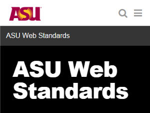
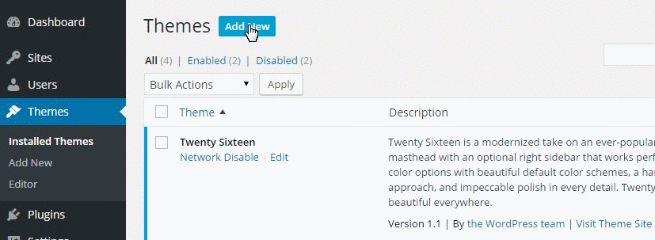
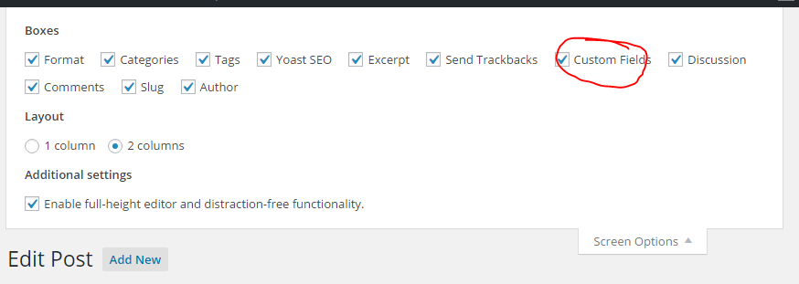
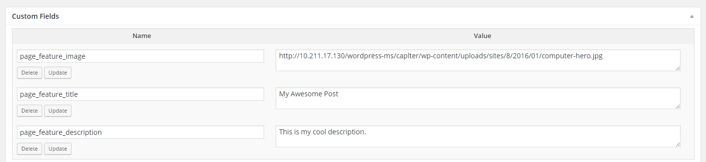

ASU-Web-Standards-Wordpress-Theme
=================================

[](https://travis-ci.org/gios-asu/ASU-Web-Standards-Wordpress-Theme) [](https://codeclimate.com/github/gios-asu/ASU-Web-Standards-Wordpress-Theme) [](http://waffle.io/gios-asu/asu-web-standards-wordpress-theme)




The ASU Web Standards Wordpress Theme (aka WordSpark) provides an enhanced theme that leverages the [ASU Web Standards Bootstrap](https://github.com/gios-asu/ASU-Web-Standards-Bootstrap) code.  The intent of this *Wordpress Theme* is to provide a source for the ASU Web Standards that can be applied to Wordpress websites.  This ASU Web Standards Wordpress repository is maintained by the [Julie Ann Wrigley Global Institute of Sustainability](http://sustainability.asu.edu).

For Web Standards documentation, checkout the [Enterprise Brand and Marketing Guide](https://brandguide.asu.edu/about/about-enterprise-marketing-hub).

## Table of contents
- [System Requirements](#system-requirements)
- [Installation](#installation)
- [The Customizer](#the-customizer)
    + [School Information](#school-information)
    + [Social Media](#social-media)
- [Creating Pages](#creating-pages)
    + [Hero Images](#hero-images)
    + [Page Templates](#page-templates)
- [Shortcodes](#shortcodes)
    + [Containers](#containers)
    + [Sidebars](#sidebars)
- [Menus](#menus)
- [Widgets](#widgets)
- [Recommended Plugins](#recommended-plugins)
- [Additional Notes](#additional-notes)
- [Developers Corner](#developers-corner)

## System Requirements
This theme requires PHP **5.4.0+** and up will work up to 7.0. It has also been tested with WordPress v4.*

## Installation

[Download the latest version of the theme](https://github.com/gios-asu/ASU-Web-Standards-Wordpress-Theme/releases/latest).

You can upload this theme to your WordPress installation by going to `Themes -> Add New -> Upload Theme -> Choose File`.



If you manually download and FTP into your server, make sure the theme lives in `wp-content/themes/ASU-Web-Standards-Wordpress-Theme`.

## The Customizer

This theme uses the WordPress customizer in `Appearance -> Customize` for you to customizer your website.

### School Information

- **Parent Organization** - This is the Parent Organization title text (ex. `Julie Ann Wrigely Global Institute of Sustainability`) that will appear to the left of the site title, seperated by a pipe (`|`).
- **Parent Organization URL** - This is the URL (ex. `http://sustainability.asu.edu`) that the page will navigate to when users click on the Parent Organization title text.
- **Phone Number** -This is the phone number (ex. `(602)-123-1234`) that will appear at the bottom of the page in the footer.  The text entered will become a link, prepended by `tel:` so that the number is clickable on mobile devices.
- **Fax Number** - Similar to the phone number, this is the fax number (ex. `+11231234`) that will appear at the bottom of the page in the footer.  The text entered will become a link, prepended by `tel:` so that the number is clickable on mobile devices.
- **Contact Us Email or URL** - The Contact Us Email or URL can be either an email address (ex. `email@address.com`) or a URL to a Contact Us form (ex. `mysite.asu.edu/contact-us`).

    If the Contact Us input is an email address, then Contact Us link will be prepended with `mailto:`, which will open up the user's default Email software if available with the `Send to` field auto-populated with th given email address.

    If the Contact Us input is a URL, then the page will navigate to that URL when users click on the Contact Us link.
- **Contact Us Email Subject (Optional)** - This field only works if the Contact Us Email or URL is an email.

    The Contact Us Email Subject (ex. `Request for Information about the School of Sustainability`) will append to the Contact Us link `?subject=X` where `X` is the value of this input encoded for urls.

    This will auto-populate the `Subject` field in the user's default Email software.
- **Contribute URL (Optional)** - This is the URL (ex. `http://mysite.asu.edu/contribute`) that the Contribute button will go to. If not given, the contribute button will not be created.

### Social Media

A new section to the customize menu has been added labeled `Social Media`.  These inputs will add social media badges and links to the footer of your website if given.

- **Facebook URL** - Your Facebook page url (ex. `https://www.facebook.com/ASUsustainability`)
- **Twitter URL**- Your Twitter profile url (ex. `https://twitter.com/asugreen`)
- **Google+ URL** - Your Google+ profile url (ex. `https://plus.google.com/+SchoolofSustainabilityTempe/about`)
- **LinkedIn URL** - Your LinkedIn page url (ex. `https://www.linkedin.com/groups/ASU-School-Sustainability-2754225/about`)
- **Youtube URL** - Your Youtube page url (ex. `https://www.youtube.com/channel/UCUjJN141U3xoZ6oJed9B8Zw`)
- **Vimeo URL** - Your Vimeo page url (ex. `https://vimeo.com/sustainability`)
- **Instagram URL** - Your Instagram url (ex. `https://www.instagram.com/arizonastateuniversity/`)
- **Flickr URL** - Your Flickr page url (ex. `https://www.flickr.com/photos/asu-gios/`)
- **Pinterest URL** - Your Pinterest page url (ex. `https://www.pinterest.com/arizonastate/`)

## Creating Pages

### Hero Images


There are three types of hero images used:

- **Normal hero** - Normal hero images have a static height - no matter what the width of the viewport is, the height will remain the same. The height of the hero will expand to fit the content, but will at least 350px is height. The recommended size for these hero images 1170px by 380 to 700px.
- **Ratio hero** - The Ratio hero will maintain a ratio of 30% height to the width of the view port. Images should be 1170px by 351px.
- **Slim hero** - The Slim hero will always maintain a height of 70px, no matter what the view port width is. These images should be 1170px by 70px.

When editing a page in Wordpress, we have added a set of custom fields that you can use to add "hero" sections to the top of your page.  To enable them, go to `Page -> Page you want to edit -> Screen Options (at the top right of the screen) -> Check Custom Field`. After your Visual/Text section of the edit page, you'll see a section labeled `Custom Fields`.



To use the following custom fields, just type in the name of the field and the value and click `Add Custom Field`.

- **page_feature_title** - The Page Feature Title (ex. `The ASU School of Sustainability`) is the text that you want to be the title in the hero section.  For SEO purposes, this will be wrapped in an `h1` tag.  It is normally similar to the Page Title.
- **page_feature_description** - The Page Feature Description (ex. `The nation's first School of Sustainability.`) is the text that will appear under the Page Feature Title.
- **page_feature_image** - The Page Feature Image (ex. './wp-content/uploads/2014/10/hero-background-1.jpg') is a absolute or relative URL to the image that you want as the background of the hero section.  It will cover the entire hero section.  For more information about the hero images, consult the [College Standards](https://brandguide.asu.edu/web-standards/academic/hero-images).
    
    Note that you can have 0 to any number of `page_feature_image` fields.  To have multiple values for the same option, create new custom fields with the same name and different values.

    If you have 0 `page_feature_image` fields, you will not have a background image behind your hero.

    If you have many `page_feature_image` fields, a random one will be chosen on page load.
- **page_feature_image_alt** - This is the alt tag for your page feature image. If you do not specify one, the title will be used.
- **page_feature_type** - The Feature type is what will control the size and behavior of the featured image. If you would like the image to maintain its ratio at any screen size then set page_feature_type to `ratio`. If you would like the feature to be just one line high then use the page_feature_type `slim`. The default page feature type doesn't need to be specified, and it will maintain the height of the featured image at the cost of the cropping and adjusting the image's ratio to fit.
- **page_feature_video** - The Page Feature Video (ex. `./wp-content/uploads/2014/10/hero-video-1.webm`) is an absolute or relative URL to the video that you want as the background of the hero section.  It will cover the entire hero section and will appear *on top of* the `page_feature_image`.  If a web browser does not support videos, the `page_feature_image` should appear instead. This is not to be confused with the featured image that WordPress lets you select you for pages and posts.

    It is not recommended that you use this option.

    Note that you can have 0 to any number of `page_feature_video` fields. To have multiple values for the same option, create new custom fields with the same name and different values.

    Note that if you have more than 1 `page_feature_video`, then **ALL** of the values will be used at the same time.  This is because it is recommended that you have the following video formats for the same video: an .mp4, an .ogv, a .3gp and a .webm.  For more information about why you need all of these file types, see the [Can I Use Video Entry](http://caniuse.com/#feat=video).
- **page_feature_color** - The Page Feature Color overrides the color of the hero image text that is set in the `page_feature_title` and `page_feature_description`. It can be 1 of the following:
    + gold
    + maroon
    + white
    + black

Here is an example of what your custom fields will look like when you add some data to it:



### Page Templates

When editting a page, you can set the page template by going to the `Page Attributes` panel and changing the `Template`.

- **Full Width Template** - This is the default template that is provided. It does not provide any containers around your content.  You will have to manually add those contains in your page's `Text`. 
- **Containered Template** - Similar to the Default Template, this will wrap your content in a container for you.

### Writing Content

The content for your Page can contain HTML. This theme disables the automatic paragraph tags that WordPress normally adds.

This allows you to use our [UI kit that is based off of Bootstrap](http://gios-asu.github.io/ASU-Web-Standards-Bootstrap/).

## Shortcodes

This theme adds the following shortcodes for you to use:

### Containers

You can write the boiler plate for a bootstrap container using the following shortcode:

```php
[container]
  Your content
[/container]
```

The container can also be made to appear gray by specifying the gray attribute:

```php
[container gray=true]
  Your content
[/container]
```

### Sidebars

You can write a sidebar for navigating the current page by using the sidebar tag.  The markup looks like this:

```php
[sidebar title='My title' affix=true spy=true]
  Text1|#idOnPage1
  Text2|#idOnPage2
  Text3|#idOnPage3
[/sidebar]
```

The title attribute is optional, it defaults to "Navigate this Doc". The affix
attribute is optional, it defaults to false. The spy attribute is optional, it defaults to false.

## Menus

This theme supports two main menus: a main navigation menu and a footer menu. 

### Main Navigation

The main navigation menu only supports a max of three levels.  The top level
of the menu will be the pills/tabs that you see in the menu. The second level will
create a basic dropdown under that pill.  A third level will force that dropdown
to become a "Mega Menu." 

Only the lowest level of pills will actually be clickable. If you create a three level deep menu, only the deepest pills will be links.

If you want to indicate that links will exit your website in the menu, go to `Custom Options->CSS Classes` and manually add the class `external-link` to you menu item.  It will add an external link icon to the right of your menu item.

If you would like to add multiple header items per column in your Mega Menu like so:


Set the title of the element to `dropdown-title`.

### Footer Menu

When creating the footer menu, we recommend clicking on "Screen Options" on the top right corner of the admin panel and selecting "CSS Classes".

Creating a Footer Menu is as easy as 1-2-3:

1. Click "Create Menu" and create top level menu items such as "Academics", "Connect", "Impact", "People", and edit these top level items to have "#" as the URL link and "h2" has the "CSS Classes (Optional)".
2. Use the "Pages" tab to add links under the top level menu items to specific pages.
3.  Click the checkbox next to "Footer Menu" in "Menu Settings" and then click "Save Menu". Your menu will now appear at the bottom of the page!

## Widgets

Extra widgets can be added to the Footer.  These will appear on the bottom of the page, after the footer menu and school information.

## Recommended Plugins

- [HTML Editor Syntax Highlighter](https://wordpress.org/plugins/html-editor-syntax-highlighter/) - Adds syntax highlighting to the Text Editor in Wordpress.
- [GitHub Updater](https://github.com/afragen/github-updater) - You can update themes and plugins that are hosted on GitHub.
- [Yoast SEO](https://yoast.com/wordpress/plugins/seo/) - SEO, breadcrumbs, sitemaps, and more!
- [Yoast Analytics](https://yoast.com/wordpress/plugins/google-analytics/) - Google analytics.

## Additional Notes

- This theme uses [RespondJS](https://github.com/scottjehl/Respond) to make media queries work on IE 6-8. If you use a CDN to host CSS files, make sure they do not use `@import` and that they also allow cross domain requests to files.

## Developers Corner

You will need [Bower](http://bower.io/) and Grunt installed

## Using Grunt:

Install the Grunt CLI by using NPM:

```
npm install -g grunt-cli
```

The following Grunt commands are available:

```
# test:
grunt test

# build:
grunt build

# all:
grunt
```

To upversion our dependencies:

```
bower update
grunt build
```

Note that you will need to upversion the version in functions.php and style.css as well.
